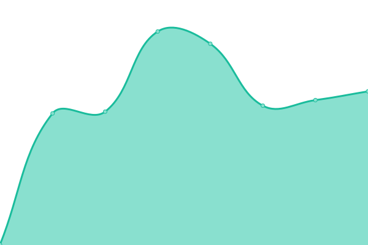
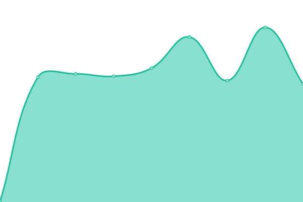
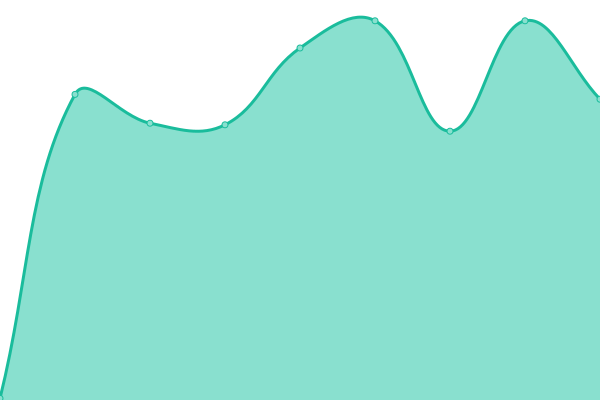
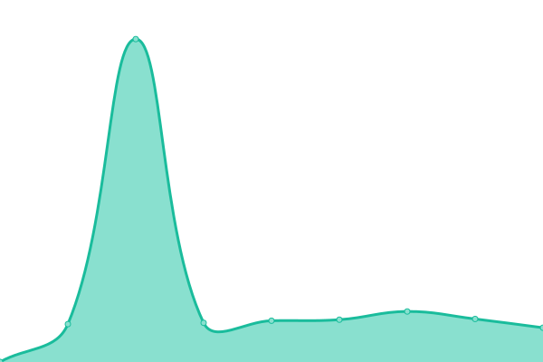

# [📈 Live Status](https://status.lykcloud.com): <!--live status--> **🟧 Partial outage**

This repository contains the open-source uptime monitor and status page for [LegendYt4k](https://status.lykcloud.com), powered by [Upptime](https://github.com/upptime/upptime).

With [Upptime](https://upptime.js.org), you can get your own unlimited and free uptime monitor and status page, powered entirely by a GitHub repository. We use [Issues](https://github.com/FreeCode911/TryStatus/issues) as incident reports, [Actions](https://github.com/FreeCode911/TryStatus/actions) as uptime monitors, and [Pages](https://status.lykcloud.com) for the status page.

<!--start: status pages-->
<!-- This summary is generated by Upptime (https://github.com/upptime/upptime) -->
<!-- Do not edit this manually, your changes will be overwritten -->
<!-- prettier-ignore -->
| URL | Status | History | Response Time | Uptime |
| --- | ------ | ------- | ------------- | ------ |
|  [LykCloud](https://lykcloud.com) | 🟩 Up | [lyk-cloud.yml](https://github.com/FreeCode911/TryStatus/commits/HEAD/history/lyk-cloud.yml) | 

 180ms
     
 | 

<a href="https://status.lykcloud.com/history/lyk-cloud">100.00%</a>
    

|  [Dashboard](https://manage.lykcloud.com/) | 🟥 Down | [dashboard.yml](https://github.com/FreeCode911/TryStatus/commits/HEAD/history/dashboard.yml) | 

 0ms
     
 | 

<a href="https://status.lykcloud.com/history/dashboard">0.00%</a>
    

|  [Panel](http://control.lykcloud.com/) | 🟥 Down | [panel.yml](https://github.com/FreeCode911/TryStatus/commits/HEAD/history/panel.yml) | 

 0ms
     
 | 

<a href="https://status.lykcloud.com/history/panel">0.00%</a>
    

|  [Kazakhstan - Node](kz.lykcloud.com) | 🟥 Down | [kazakhstan-node.yml](https://github.com/FreeCode911/TryStatus/commits/HEAD/history/kazakhstan-node.yml) | 

 0ms
     
 | 

<a href="https://status.lykcloud.com/history/kazakhstan-node">0.00%</a>
    

|  [Poland - Node](pl.lykcloud.com) | 🟩 Up | [poland-node.yml](https://github.com/FreeCode911/TryStatus/commits/HEAD/history/poland-node.yml) | 

 139ms
     
 | 

<a href="https://status.lykcloud.com/history/poland-node">95.03%</a>
    

|  [Minolink](https://minolink.us.kg/) | 🟥 Down | [minolink.yml](https://github.com/FreeCode911/TryStatus/commits/HEAD/history/minolink.yml) | 

 0ms
     
 | 

<a href="https://status.lykcloud.com/history/minolink">0.00%</a>
    

|  [PicGenV - API](https://text-to-image.legendyt4k.me/) | 🟥 Down | [pic-gen-v-api.yml](https://github.com/FreeCode911/TryStatus/commits/HEAD/history/pic-gen-v-api.yml) | 

 0ms
     
 | 

<a href="https://status.lykcloud.com/history/pic-gen-v-api">0.00%</a>
    

<!--end: status pages-->

[**Visit our status website →**](https://status.lykcloud.com)

## 📄 License

- Powered by: [Upptime](https://github.com/upptime/upptime)
- Code: [MIT](./LICENSE) © [Anand Chowdhary](https://anandchowdhary.com), supported by [Pabio](https://pabio.com)
- Data in the `./history` directory: [Open Database License](https://opendatacommons.org/licenses/odbl/1-0/)
